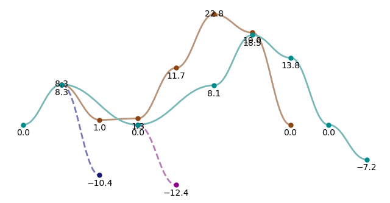

# plotProfile
notebook to plot reaction profiles

- label placement needs sorted
- add option for straight line connections
- RDkit structures...??

# Reaction Profile Plotter

Plot reaction profiles from energy data using smooth Bezier curves with customizable styling.



## Features
- Plot multiple energy sets with smooth curves
- Optional dashed line styles per curve
- Dot or bar style data points
- Automatic label placement with smart positioning
- Export to EPS, PNG, SVG, or PDF formats
- Command line interface for quick plotting

## Installation

```bash
git clone X
pip install .
```

## Usage

### Python
```python
from plotProfile import plot_profile
import numpy as np

energy_sets = [
    [0.00, 8.31, 0.00, 0.00, 0.00, 8.13, 18.5, 13.83, 0.00, -7.17],
    [np.nan, 8.31, 1.0, 1.3, 11.73, 22.81, 19.02, 0.00],
    [np.nan, 8.31, -10.4],
    [np.nan, np.nan, np.nan, 0.0, -12.4],
]

plot_profile(energy_sets, filename="reaction_profile", labels=True, point_type="dot", desaturate_curve=True)
```

### CLI
```bash
python -m plotProfile --input examples/input.json --labels --format png
```


