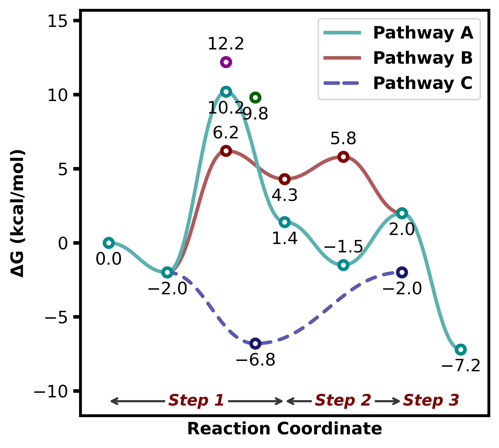
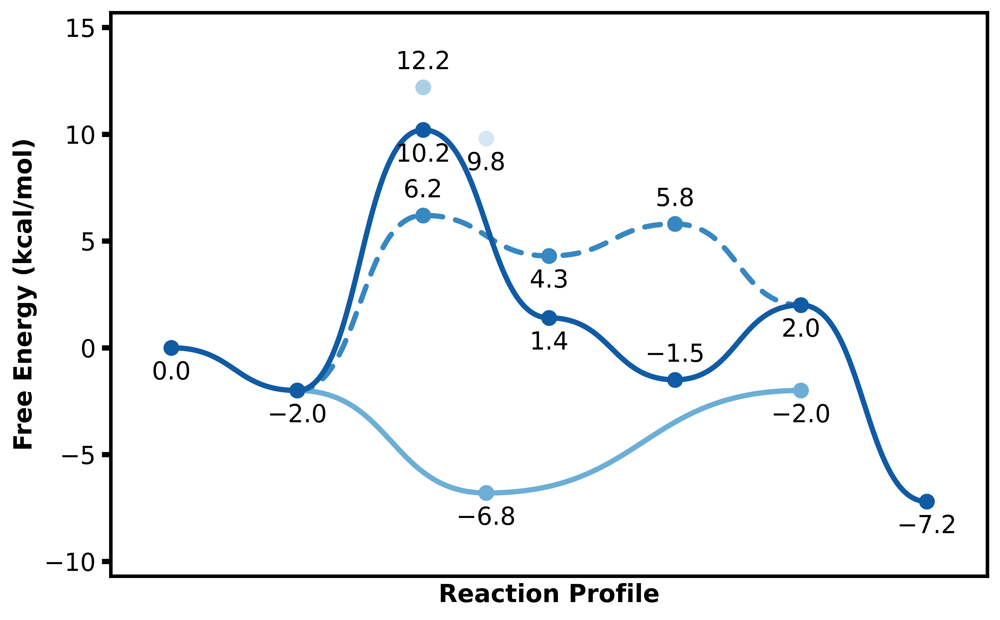

# plotProfile
Python code for plotting reaction profiles with various style options

## Installation
```bash
git clone git@github.com:aligfellow/plotProfile.git
cd plotProfile
pip install .
```
- *check the installation, `pip install .` seems to not respect the json locally*

## To Do
- label placement is primitive and could be improved
   - for now these can be tweaked with postprocessing 
- check cli options

## Python Usage examples
Use case for example: 
```python
import plotProfile
import numpy as np

energy_sets = {
    "Pathway A": [0.00, -2.0, 10.2, 1.4, -1.5, 2.0, -7.2],
    "Pathway B": [np.nan, -2.0, 6.2, 4.3, 5.8, 2.0],
    "Pathway C": [np.nan, -2.0, -6.8,-6.8],
}

annotations = {
    'Step 1': (0,3),
    'Step 2': (3,5),
    'Step 3': (5,6),
}

plotter = plotProfile.plot.ReactionProfilePlotter(dashed=["off-cycle", "Pathway C"], segment_annotations=annotations)
plotter.plot(energy_sets)
```
Pass in `annotations` for labelling of the reaction profile:



A variety of paremters can be tuned for the plotting, including:
- `axes="box|y|x|both|None"` 
- `curviness=0.42` - reduce for less curve and vice versa
- `colors=["list","of","colors"]|cmap` - specify colour list or colour map
- `show_legend=Bool`
- `units="kj|kcal"`
- `energy="e|electronic|g|gibbs|h|enthalpy|s|entropy|"`

For example:
```python
plotter = plotProfile.plot.ReactionProfilePlotter(style="presentation", dashed=["off-cycle", "branching"], point_type='bar', desaturate=False, colors='Blues_r', show_legend=False, curviness=0.5)
plotter.plot(energy_sets)
```
Using `style="presentation"` which sets a larger `figsize=(X,X)`, thicker lines, larger font size:



For example:
```python
plotter = plotProfile.plot.ReactionProfilePlotter(style="straight", figsize=(6,4), dashed=["off-cycle", "branching"], point_type='dot', segment_annotations=annotations, annotation_color='black', axes='y', colors=['darkseagreen', 'slateblue', 'darksalmon'], energy='electronic', units='kj')
plotter.plot(energy_sets)
```
Straight lines set in a style, which can also be done by passing in `curviness=0`:


See [examples/example.ipynb](examples/example.ipynb) for more explicit code

## CLI
Currently untested - probably won't work for now
```bash
python -m plotProfile --input examples/input.json --labels --format png
```


